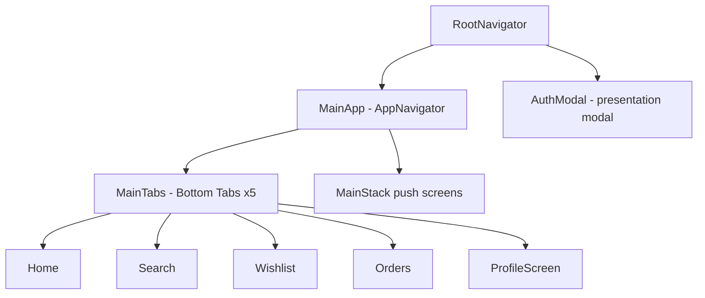
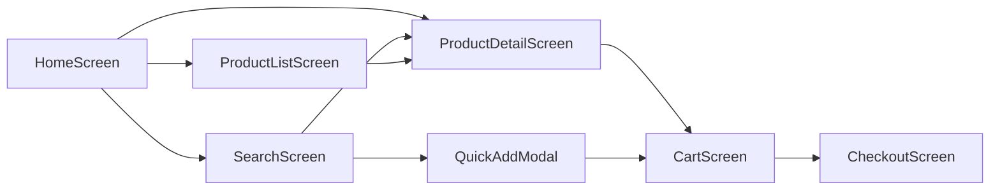

# Zuba Mobile App — UI, Product Features & Responsiveness Report

**Purpose:** Deep dive into the Expo mobile shopper app so the **web storefront** (`client/`) and optionally **web admin** (`admin/`) can mirror the same UX patterns, product behavior, and responsive layout model.

**Generated:** May 22, 2026  
**Scope:** `mobile/` (primary), comparison with `client/` (storefront)

---

## Executive summary

| Topic | Finding |
|-------|---------|
| **Platform** | Expo 54 + React Native 0.81 + React Navigation 6 |
| **Navigation** | 5 bottom tabs + native stack for commerce/detail |
| **Responsive model** | **Phone-first math** via `Dimensions.get('window')` at module load — not CSS breakpoints, no tablet layout |
| **Product UX** | Dense Temu/Shein-style cards, 2-column grids, Quick Add modal, rich PDP with tabs |
| **Design tokens** | `#0b2735` / `#efb291` / `#e5e2db` — partially duplicated in `ThemeContext` |
| **Web gap** | Web uses Tailwind `md:`/`lg:` + `windowWidth < 992`; mobile uses width formulas — **align via shared tokens + grid CSS mapping** |
| **Reviews on mobile** | **Mock/sample data** on PDP — not API-backed yet |

---

## 1. App architecture & navigation

### 1.1 Provider stack (entry)

**File:** `mobile/App.tsx`

- Redux (`store`)
- `ThemeProvider` (dark mode — partial adoption)
- `CurrencyProvider` (CAD base + `formatPrice`)
- `react-native-paper` theme (roundness 16, brand colors)
- `AuthProvider` + `RootNavigator`

### 1.2 Navigation hierarchy



| Layer | File | Responsibility |
|-------|------|----------------|
| Root | `mobile/src/navigation/RootNavigator.tsx` | `NavigationContainer`, splash, `AuthModal` |
| Main | `mobile/src/navigation/AppNavigator.tsx` | Tabs + stack screens |
| Auth | `mobile/src/navigation/AuthNavigator.tsx` | Login → Register → Forgot → OTP → Reset |
| Helpers | `mobile/src/navigation/navigationHelpers.ts` | `navigateToProductDetail`, `navigateToProductList`, banner deep links |
| Types | `mobile/src/constants/routes.ts` | `ProductListParams`, filter enums |

### 1.3 Bottom tabs (`MainTabParamList`)

| Tab | Screen | Path |
|-----|--------|------|
| Home | `HomeScreen` | `screens/Home/HomeScreen.tsx` |
| Search | `SearchScreen` | `screens/Search/SearchScreen.tsx` |
| Wishlist | `WishlistScreen` | `screens/Wishlist/WishlistScreen.tsx` |
| Orders | `OrdersScreen` | `screens/Orders/OrdersScreen.tsx` |
| Account | `ProfileScreen` | `screens/Profile/ProfileScreen.tsx` |

**Tab bar styling** (`AppNavigator.tsx`):

- Height: **65px**
- Active tint: `Colors.secondary` (`#efb291`)
- Inactive: `Colors.primary` (`#0b2735`)
- White background, top border `Colors.border`

### 1.4 Main stack screens (commerce & account)

Pushed on top of tabs (not tab routes):

| Category | Screens |
|----------|---------|
| **Catalog** | `ProductDetail`, `ProductList`, `Categories`, `Brands` |
| **Commerce** | `Cart`, `Checkout`, `Payment`, `OrderConfirmation`, `OrderDetail` |
| **Account** | `Settings`, `EditProfile`, `ChangePassword`, `PrivacySettings`, `NotificationPreferences`, `Notifications` |
| **Address / support** | `AddAddress`, `SelectLocation`, `HelpSupport`, `ReturnPolicy`, `SafePaymentsPrivacy`, `About` |

**Header pattern:**

- Most screens: `headerShown: false` + **custom in-screen header** (back + title + actions)
- Exceptions with native stack header: `ProductList`, `OrderDetail`
- Stack header chrome: cream `#f5f0eb`, title `#1a2332`, bold 700

**Cart is not a tab** — reached via `SearchBar` badge, PDP header, or stack `navigate('Cart')`.

### 1.5 Modals (in-screen)

| Modal | File | Trigger |
|-------|------|---------|
| Auth flow | `RootNavigator` | `presentation: 'modal'` |
| Quick Add (variations) | `components/QuickAddModal.tsx` | Search grid, variable products |
| Size guide | `ProductDetailScreen.tsx` | PDP size table |
| Added to cart | `ProductDetailScreen.tsx` | Post add success sheet |
| Settings picker | `components/settings/PickerSheet.tsx` | Language, currency |

---

## 2. Design system

### 2.1 Brand colors (primary — used on most screens)

**File:** `mobile/src/constants/colors.ts`

| Token | Hex | Usage |
|-------|-----|--------|
| `primary` | `#0b2735` | Text, icons, headers |
| `secondary` | `#efb291` | Accent, tab active, cart icon, loaders |
| `tertiary` | `#e5e2db` | Backgrounds, borders, image placeholders |
| `white` | `#ffffff` | Cards |
| `shadow` | `rgba(11, 39, 53, 0.15)` | Card elevation |
| `background` | `#e5e2db` | Page backgrounds (alias of tertiary) |

### 2.2 ThemeContext (semantic — partial adoption)

**File:** `mobile/src/context/ThemeContext.tsx`

Light palette adds:

- `background: #f5f0eb` (warm cream — matches web header area)
- `text: #1a2332`, `textMuted: #6b7280`
- `danger: #dc2626`

**Used consistently in:** Settings screens (`SettingsSubScreen`, `PickerSheet`), navigation theme in `RootNavigator`.

**Most product/home screens still import static `Colors`** from `constants/colors.ts`, not `useAppTheme()`.

### 2.3 Typography & spacing (convention, not a package)

There is **no** shared `typography.ts` or `spacing.ts`. Per-screen `StyleSheet.create` uses:

| Role | Typical values |
|------|----------------|
| Page title | 18–20px, `fontWeight: '700'` |
| Body | 12–15px |
| Section label (settings) | 12px uppercase, `letterSpacing: 0.5` |
| Padding rhythm | **12, 16, 24** |
| Card radius | **8–14** |
| Muted text | Often hard-coded `#6b7280` |

### 2.4 react-native-paper

Mapped in `App.tsx` — `roundness: 16`. Used for `Button`, `ActivityIndicator` on auth and error states.

### 2.5 Internationalization & currency

| Module | File |
|--------|------|
| i18n | `mobile/src/i18n/index.ts`, `locales/en.json`, `fr.json` |
| Currency | `mobile/src/context/CurrencyContext.tsx` — rates + `formatPrice()` |

---

## 3. Responsive & layout model (critical for web parity)

### 3.1 How mobile handles “responsiveness”

Mobile does **not** use CSS media queries or `useWindowDimensions`. It uses:

```ts
const { width: SCREEN_WIDTH } = Dimensions.get('window');
```

Captured **once at module load** — does not update on rotation or split-screen unless the app reloads that module.

### 3.2 Informal breakpoints (phone widths only)

| Condition | Behavior |
|-----------|----------|
| `SCREEN_WIDTH < 375` | Narrow phone — Search category sidebar **100px** |
| `SCREEN_WIDTH < 414` | Medium phone — sidebar **110px** |
| `SCREEN_WIDTH >= 414` | Default phone — sidebar **120px** |

**No tablet or desktop layout branch exists.**

### 3.3 Grid width formulas (copy to CSS)

| Screen | Formula | Meaning |
|--------|---------|---------|
| **Home** | `(width - 36) / 2` | 2 columns: 12px side padding ×2 + 12px gap |
| **Search** | `(SCREEN_WIDTH - SIDEBAR - 24) / 2` | Sidebar subtracted first |
| **Product list** | `numColumns={2}` on `FlatList` | Same card component |
| **PDP recommend** | `(SCREEN_WIDTH - 48) / 2` | Related products grid |
| **Flash sale carousel** | `SCREEN_WIDTH * 0.38` per card | Horizontal peek |
| **Home promo banners** | `SCREEN_WIDTH * 0.48` | Half-width tiles |

**Search implementation** (`SearchScreen.tsx` lines 46–49):

```ts
const CATEGORY_SIDEBAR_WIDTH = SCREEN_WIDTH < 375 ? 100 : SCREEN_WIDTH < 414 ? 110 : 120;
const PRODUCT_GRID_WIDTH = SCREEN_WIDTH - CATEGORY_SIDEBAR_WIDTH;
const CARD_WIDTH = (PRODUCT_GRID_WIDTH - 24) / 2;
```

### 3.4 Safe area & status bar

| Approach | Where |
|----------|-------|
| `useSafeAreaInsets` | `SettingsScreen` only |
| `SafeAreaView` | Auth screens |
| Manual `paddingTop` | Most screens: `Platform.OS === 'ios' ? 56 : 40` |

### 3.5 Layout primitives

- Root: `flex: 1`
- Lists: `FlatList` everywhere with shared perf props (`utils/flatListPerf.ts`)
- Images: `expo-image`, `contentFit="cover"`, blurhash on `ProductCard`
- Performance: `InteractionManager.runAfterInteractions`, `useDeferredReady(120)` on Home below-fold sections

### 3.6 Web storefront responsive model (comparison)

**File:** `client/src/responsive.css` — dedicated **320px–992px** mobile block (cart, checkout, product grids).

**File:** `client/src/components/Header/index.jsx` — primary breakpoint **`992px`** via `context.windowWidth`:

- `< 992`: fixed header, slide-out search, `mt-[115px]` spacer
- `>= 992`: sticky header, top strip, inline search

**Search grid** (`client/src/Pages/Search/index.jsx`):

```jsx
grid-cols-2 sm:grid-cols-3 md:grid-cols-4 lg:grid-cols-5  // grid view
```

**Mismatch:** Web scales columns at `sm/md/lg`; mobile always uses **2 columns** with math-based card width.

---

## 4. Product features — complete map

### 4.1 Screens

| Feature | Screen | Path |
|---------|--------|------|
| Home merchandising | `HomeScreen` | `screens/Home/HomeScreen.tsx` |
| Search + Lens | `SearchScreen` | `screens/Search/SearchScreen.tsx` |
| Filtered PLP | `ProductListScreen` | `screens/Products/ProductListScreen.tsx` |
| PDP | `ProductDetailScreen` | `screens/Products/ProductDetailScreen.tsx` (~2700+ lines) |
| Categories | `CategoriesScreen` | `screens/Categories/CategoriesScreen.tsx` |
| Brands | `BrandsScreen` | `screens/Brands/BrandsScreen.tsx` (3-col grid) |
| Cart | `CartScreen` | `screens/Cart/CartScreen.tsx` |
| Wishlist | `WishlistScreen` | `screens/Wishlist/WishlistScreen.tsx` |

### 4.2 Home merchandising components

| Component | Role |
|-----------|------|
| `ProductCard` | Universal grid card |
| `FlashSale` | Horizontal sale strip + countdown |
| `TrendingProducts` | 2-col grid section |
| `CategoryDeals` | Category tiles |
| `DealOfTheDay` | Featured single deal |
| `RecentlyViewed` | AsyncStorage horizontal list |
| `DailyCheckIn` | Promo gamification |
| `ReferralBanner` | Referral CTA |
| `SearchBar` | Header search + cart badge (shared) |

Home defers heavy sections: `useDeferredReady(120)` — loads FlashSale, etc. after 120ms.

### 4.3 ProductCard — canonical listing UI

**File:** `mobile/src/components/ProductCard.tsx`

| Element | Spec |
|---------|------|
| Image height | **180px** fixed |
| Card radius | **8px** |
| Margin | **6px** per card |
| Sale badge | `#E60012`, “ON SALE” |
| Low stock ribbon | “LAST N AT PROMO PRICE” when stock ≤ 10 |
| OOS ribbon | Red `rgba(220,38,38,0.9)` |
| Name | 12px, 2 lines, minHeight 32 |
| Stars | Unicode ★/☆, gold `#FFB800` |
| Price | 16px bold; strikethrough original |
| Cart CTA | `Ionicons add-circle` 24px, peach color |

**Business logic shared with web:**

- `getProductStock` / `isProductOutOfStock` from `utils/productStock.ts` — comment explicitly aligns with `client/src/components/ProductItem`
- Variable products: min variation price when parent price is 0
- Image URL normalization (rejects 24-char Mongo ObjectIds)

### 4.4 Product list filters

**Params** (`constants/routes.ts` + `ProductListScreen`):

- `title`, `subtitle`, `categoryId`, `categoryName`, `categoryFilter`, `filter`, `sortBy`

**Client-side filters** (`applyListFilter`):

| `filter` value | Behavior |
|----------------|----------|
| `flash-sale` / `sale` | Items with sale pricing |
| `featured` | `featured` flag or on sale |
| `new-arrivals` | Sort by `createdAt` desc |
| `trending` | Score: wishlist×2 + sales×3 + views |

**API:** `productService.getAllProducts` with optional category resolve.

**Not on mobile:** price slider, multi-facet filter sheet (web Search has sidebar filters).

### 4.5 Product detail (PDP)

**File:** `mobile/src/screens/Products/ProductDetailScreen.tsx`

| Area | Implementation |
|------|----------------|
| **Images** | Square carousel `IMAGE_HEIGHT = SCREEN_WIDTH`; paging by screen width |
| **Tabs** | `Goods` \| `Reviews` \| `Recommend` |
| **Variations** | Attribute chips → `selectedVariation`; gate before add-to-cart |
| **Size guide** | `getSizeGuideData()` + full-screen `Modal` |
| **Reviews** | **`getSampleReviews()` — synthetic**, not API |
| **Stock** | `productStock.ts` + per-variation `isVariationInStock` |
| **Header** | Custom: back, wishlist, share, cart badge |
| **CTA** | Fixed bottom bar (add to cart / buy now pattern) |
| **Related** | `Recommend` tab: nested `FlatList` `numColumns={2}` |
| **Post-add** | “Added to cart” modal sheet |

### 4.6 Search screen features

| Feature | Detail |
|---------|--------|
| Debounce | **300ms** on text search |
| APIs | `searchService.search` + `productService.searchProducts` fallback |
| Category sidebar | Fixed width by breakpoint (see §3.2) |
| Top category tabs | Preferred: Women, Curve, Kids, Men, Home, Beauty |
| Recent searches | AsyncStorage, max **10** |
| Popular chips | Sandals, African Fashion, etc. |
| **Lens** | `expo-image-picker` + image search endpoint |
| **Quick Add** | `QuickAddModal` for variable products from grid |
| Empty state | Icon + title + subtitle + suggestion chips |

### 4.7 Quick Add modal

**File:** `mobile/src/components/QuickAddModal.tsx`

- Opens from Search (and grids) when product has variations
- Fetches full product if variations missing on list payload
- Requires variation selection before add
- Syncs Redux `cartSlice` + `cartService` (guest vs auth)

**Web equivalent today:** `ProductItem` redirects variable products to PDP with info toast — **no inline quick-add**.

### 4.8 Cart & wishlist

| | Cart | Wishlist |
|--|------|----------|
| State | Redux `cartSlice` + `cart.service` | `wishlist.service` + local guest list |
| Guest | AsyncStorage | `getLocalWishlist()` |
| Auth sync | On screen focus | API |
| Entry | Stack route, not tab | Tab + Profile menu |

### 4.9 Platform & channel filtering (mobile-only)

**File:** `mobile/src/services/product.service.ts`

```ts
// All product fetches include platform: 'mobile'
function isProductVisibleOnMobile(product) {
  if (product.appExclusive) return true;
  if (!product.channels?.length) return true;
  return product.channels.includes('mobile');
}
```

Web storefront should mirror with `platform: 'web'` and `channels.includes('web')` for parity.

### 4.10 Services & shared utils

| File | Role |
|------|------|
| `services/product.service.ts` | CRUD, search, mobile filter |
| `services/cart.service.ts` | Cart API |
| `services/wishlist.service.ts` | Wishlist API |
| `services/search.service.ts` | Text + image search |
| `utils/productStock.ts` | Stock semantics (shared with web) |
| `utils/productDisplay.ts` | Price filtering, “almost gone” |
| `utils/productImages.ts` | `collectProductImageUrls`, `unwrapProductPayload` |
| `store/slices/cartSlice.ts` | Normalizes API/guest cart shapes |

---

## 5. UI component library & patterns

### 5.1 Component inventory (`mobile/src/components/`)

| Component | Notes |
|-----------|-------|
| `ProductCard` | Core listing unit |
| `SearchBar` | Shared header |
| `QuickAddModal` | Variation picker |
| `FlashSale`, `TrendingProducts`, `CategoryDeals`, `DealOfTheDay` | Home sections |
| `RecentlyViewed`, `ReferralBanner`, `DailyCheckIn` | Engagement |
| `FreeShippingBanner`, `LimitedStock`, `VerifiedBadge` | Merchandising badges |
| `ErrorBoundary` | Wraps navigation |
| `toastConfig` | `react-native-toast-message` styling |
| `settings/*` | `SettingsSubScreen`, rows, toggles — **theme-aware** |

### 5.2 Patterns reference

| Pattern | Mobile implementation | Web should |
|---------|----------------------|------------|
| **Loading** | `ActivityIndicator` (Paper) | Add skeleton grids (`ProductLoadingGrid` exists on web) |
| **Empty state** | Large icon/emoji + title + subtitle + chips | Match copy + layout from Search |
| **Lists** | `FlatList` + `FLATLIST_PERF` | CSS grid or virtual list with similar batch sizes |
| **Buttons** | `TouchableOpacity` + Paper `Button` | Peach primary CTAs `#efb291` |
| **Headers** | Custom row, manual safe padding | Sticky header at `< 992` already exists |
| **Toasts** | `react-native-toast-message` | `react-hot-toast` on web — align success/error styling |
| **Images** | `expo-image` + blurhash | Lazy load + aspect-ratio boxes |

### 5.3 FlatList performance defaults

**File:** `mobile/src/utils/flatListPerf.ts`

```ts
FLATLIST_PERF = {
  removeClippedSubviews: true,
  maxToRenderPerBatch: 6,
  initialNumToRender: 6,
  windowSize: 5,
}
```

Web long lists: consider `react-window` with `overscan ≈ 2 rows` equivalent.

---

## 6. Key non-product screens (brief)

| Area | Screens | Notes |
|------|---------|-------|
| Profile hub | `ProfileScreen` | Links to orders, wishlist, addresses, settings |
| Orders | `OrdersScreen`, `OrderDetailScreen` | Auth gate on list |
| Checkout | `CheckoutScreen`, `PaymentScreen`, `OrderConfirmationScreen` | Module in `features/checkout/` |
| Checkout tag | `ORDER_SOURCE_TAG = 'zuba_mobile_app'` | Distinguishes mobile orders |
| Address | `AddAddressScreen`, `SelectLocationScreen` | Map picker |
| Settings | 7 screens under `screens/Settings/` | Dark mode toggle here |
| Auth | `features/auth/*` | Modal presentation from root |

---

## 7. Mobile vs web storefront comparison

### 7.1 Brand color alignment

| Token | Mobile | Web `client` header | Web Tailwind `primary` |
|-------|--------|---------------------|------------------------|
| Primary | `#0b2735` | `#0b2735` | — |
| Accent | `#efb291` | `#efb291` | `#eeb190` ⚠️ typo drift |
| Tertiary | `#e5e2db` | `#e5e2db` | — |
| Cream BG | `#f5f0eb` (ThemeContext) | — | — |

**Action:** Fix `client/tailwind.config.js` `primary: '#eeb190'` → `#efb291`.

### 7.2 Navigation model

| Mobile | Web `client` |
|--------|--------------|
| 5 bottom tabs | Top header + routes |
| Cart = stack | `/cart` page |
| Auth = modal stack | `/login`, `/register` pages |
| ~27 stack screens | Larger marketing/legal surface |

### 7.3 Product UX differences

| Capability | Mobile | Web `client` |
|------------|--------|--------------|
| Variable add from grid | `QuickAddModal` | Redirect to PDP + toast |
| Reviews on PDP | Mock reviews | Likely real UI in `ProductDetails` |
| Search layout | Left category sidebar + 2-col | Collapsible sidebar + responsive grid |
| Image search | Lens (camera) | Algolia optional |
| Platform filter | `platform=mobile` + channels | Not mirrored in service layer |
| Grid columns | Always 2 (phone math) | 2 → 5 by breakpoint |
| Dark mode | Settings (partial on product screens) | Not centralized |

### 7.4 What web already does better

- **Skeleton loaders** (`ProductLoadingGrid`, `LoadingSkeleton`)
- **Responsive column scaling** at `sm/md/lg`
- **Dedicated `responsive.css`** for cart/checkout mobile
- **Algolia** search integration (optional)

### 7.5 What mobile does better (port to web)

- **Quick Add** for simple variations without leaving PLP
- **Consistent empty-state template** with suggestion chips
- **Deferred home section loading** (perceived performance)
- **Low-stock / promo ribbons** on cards (Temu-style)
- **Unified stock semantics** via `productStock.ts` (already documented on both sides)

---

## 8. Recommendations — apply mobile responsiveness to web

### Phase 1: Shared design tokens (1–2 days)

Create `packages/theme` or `shared/brand.css`:

```css
:root {
  --zuba-primary: #0b2735;
  --zuba-secondary: #efb291;
  --zuba-tertiary: #e5e2db;
  --zuba-background: #f5f0eb;
  --zuba-danger: #dc2626;
  --space-3: 12px;
  --space-4: 16px;
  --space-6: 24px;
  --radius-card: 8px;
  --radius-panel: 14px;
}
```

Import in `client/src/index.css` and `admin/src/App.css`.

### Phase 2: Grid CSS mapping (mobile formulas → Tailwind)

| Mobile | Web CSS / Tailwind |
|--------|-------------------|
| `(width - 36) / 2` | `grid grid-cols-2 gap-3 px-3` on `< 640px` |
| Search sidebar 100–120px | `w-[100px] sm:w-[110px] md:w-[120px]` fixed sidebar |
| 2-col phone only | `grid-cols-2` default; `sm:grid-cols-3 md:grid-cols-4 lg:grid-cols-5` from `sm` up |
| Card image 180px | `aspect-[4/5]` or `h-[180px]` on product cards |
| PDP square image | `aspect-square w-full` on gallery |

### Phase 3: Product behavior parity

1. **Extract shared package** `@zuba/product-utils`: `productStock.ts`, `productDisplay.ts`, `productImages.ts`, `unwrapProductPayload`
2. **Quick Add drawer** on web PLP (mirror `QuickAddModal.tsx`) — keep PDP redirect for complex attribute matrices
3. **Platform channel filter** on web `product.service` / API calls: `platform=web`
4. **Card ribbons** — port `showPromoBanner` / OOS logic from `ProductCard` to `ProductItem`
5. **Reviews** — either wire real API on mobile or hide Reviews tab until backend exists

### Phase 4: Responsive breakpoint alignment

| Use case | Mobile threshold | Web recommendation |
|----------|------------------|-------------------|
| Narrow phone | `< 375` | `@media (max-width: 374px)` — tighter search sidebar |
| Standard phone | `< 414` | `(max-width: 413px)` |
| Mobile layout | implicit phone | `(max-width: 991px)` — matches existing `992` |
| Desktop | N/A | `(min-width: 992px)` |

Keep **`992px`** as the single primary breakpoint on web (already in `Header`, `responsive.css`) — do not introduce a second system.

### Phase 5: Performance patterns

| Mobile | Web |
|--------|-----|
| `useDeferredReady(120)` | Lazy-load below-fold home sections (`React.lazy` + `requestIdleCallback`) |
| `InteractionManager` | Defer non-critical fetches after first paint |
| `FLATLIST_PERF` | Virtualize PLP when > 50 items |
| `React.memo(ProductCard)` | `memo(ProductItem)` if props stable |

### Phase 6: Empty & loading UX

Standardize web empty state to match Search mobile template:

```
[icon 48px]
Title (18px bold)
Subtitle (14px muted)
[chip] [chip] [chip]  ← popular searches / categories
[Primary CTA button]
```

Use existing `ProductLoadingGrid` during fetch — mobile has no equivalent (web can lead here).

---

## 9. Implementation checklist (web storefront)

- [ ] Fix Tailwind `primary` color to `#efb291`
- [ ] Import shared CSS variables for brand colors
- [ ] Map home/search grids: `grid-cols-2` + `gap-3` + `px-3` below `sm`
- [ ] Search page: fixed category sidebar widths 100/110/120px by breakpoint
- [ ] Product card: 180px image height, sale/OOS/promo ribbons from mobile
- [ ] Quick Add bottom sheet for variable products on PLP
- [ ] `platform=web` + channel filter in product API client
- [ ] Shared `productStock` / `productImages` npm workspace package
- [ ] Empty state component shared copy with mobile Search
- [ ] PDP: `aspect-square` gallery; optional tab layout like mobile Goods/Reviews/Recommend
- [ ] Verify `responsive.css` cart/checkout rules still match after grid changes

---

## 10. File reference index

### Navigation
- `mobile/src/navigation/RootNavigator.tsx`
- `mobile/src/navigation/AppNavigator.tsx`
- `mobile/src/navigation/navigationHelpers.ts`
- `mobile/src/constants/routes.ts`

### Design
- `mobile/src/constants/colors.ts`
- `mobile/src/context/ThemeContext.tsx`
- `mobile/src/context/CurrencyContext.tsx`

### Product UI
- `mobile/src/components/ProductCard.tsx`
- `mobile/src/components/QuickAddModal.tsx`
- `mobile/src/components/SearchBar.tsx`
- `mobile/src/screens/Home/HomeScreen.tsx`
- `mobile/src/screens/Search/SearchScreen.tsx`
- `mobile/src/screens/Products/ProductListScreen.tsx`
- `mobile/src/screens/Products/ProductDetailScreen.tsx`

### Product logic
- `mobile/src/services/product.service.ts`
- `mobile/src/utils/productStock.ts`
- `mobile/src/utils/productDisplay.ts`
- `mobile/src/utils/productImages.ts`
- `mobile/src/store/slices/cartSlice.ts`

### Performance
- `mobile/src/utils/flatListPerf.ts`
- `mobile/src/hooks/useDeferredReady.ts`

### Web comparison
- `client/src/components/ProductItem/index.jsx`
- `client/src/components/Header/index.jsx`
- `client/src/Pages/Search/index.jsx`
- `client/src/responsive.css`
- `client/tailwind.config.js`

---

## 11. Diagram — product browse flow (mobile)



---

*End of report. For admin UI alignment, see prior admin UX report; this document focuses on the consumer mobile app and web storefront parity.*
